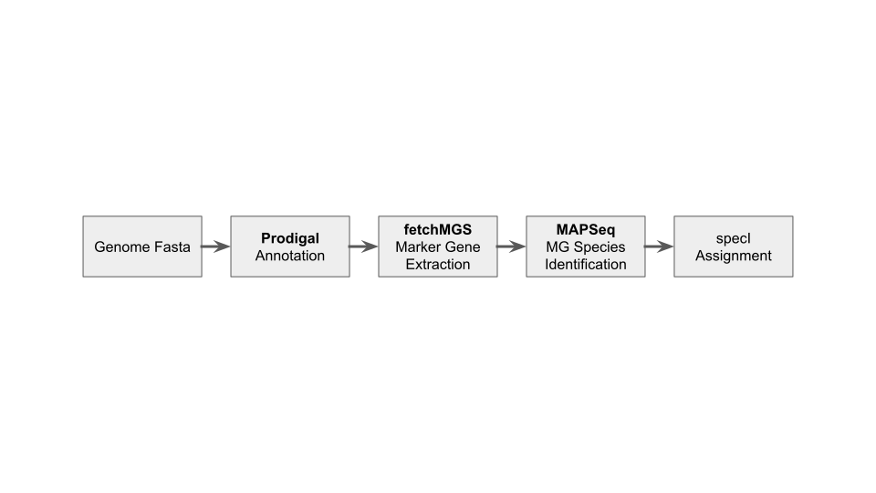

reCOGnise
=========

`reCOGnise` is a tool/pipeline for species assignment (specI cluster) of microbial genomes using COG marker genes. `reCOGnise` is a port of a workflow that was used e.g. for species assignment of the [proGenomes database](https://progenomes.embl.de). This work was supported by [NFDI4Microbiota](https://nfdi4microbiota.de/).

